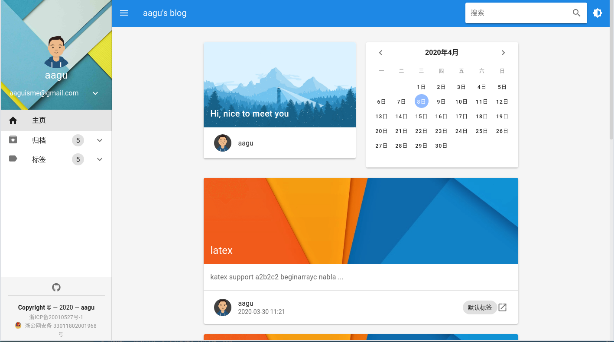
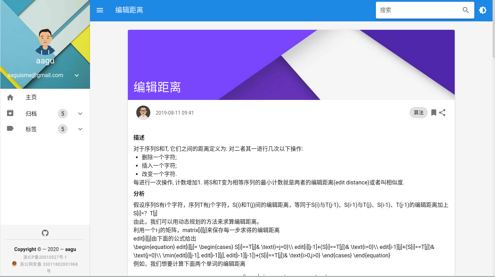
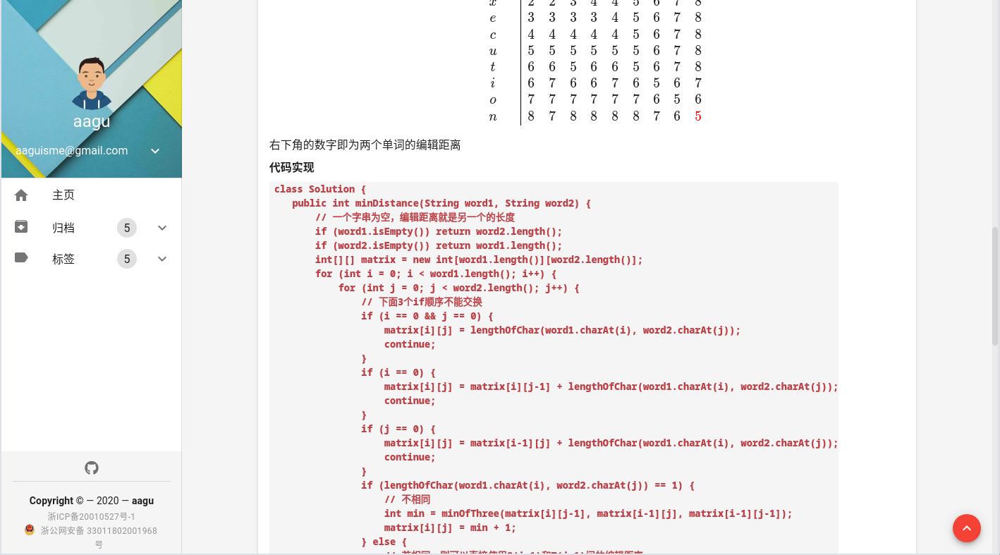
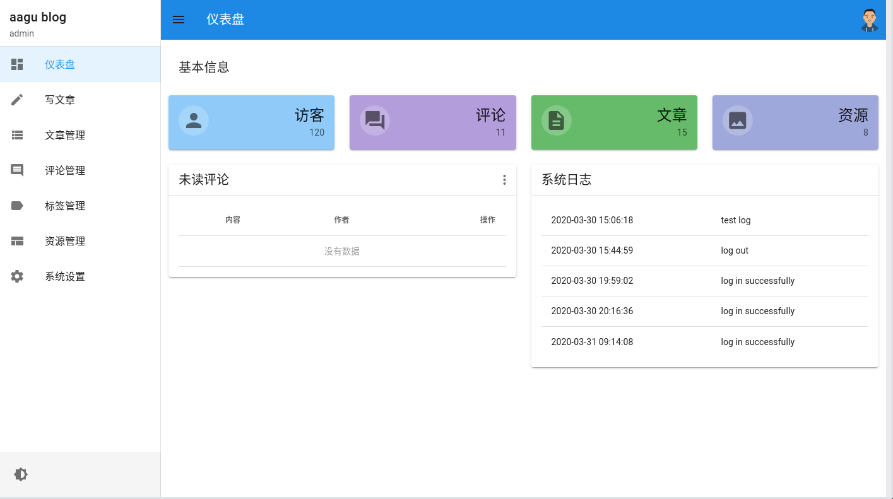
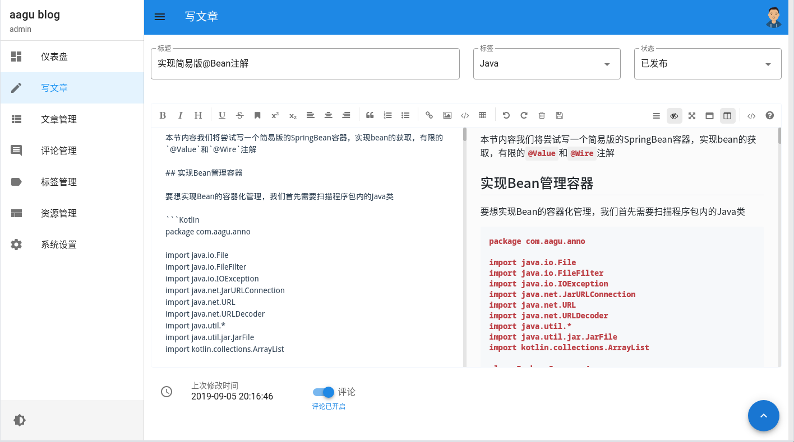
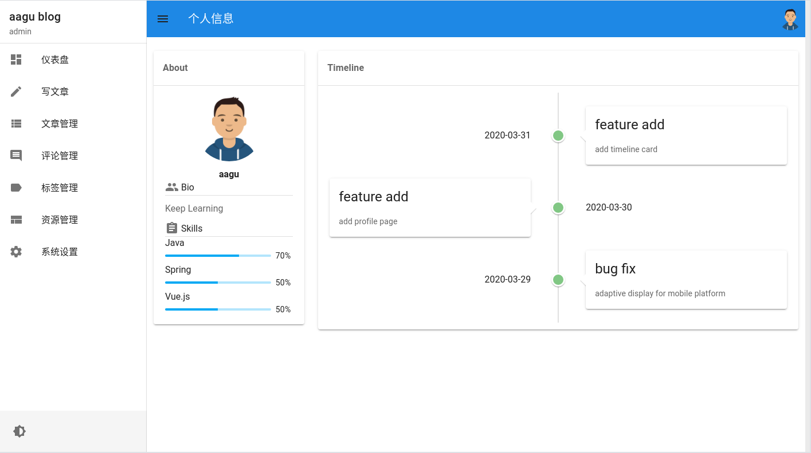
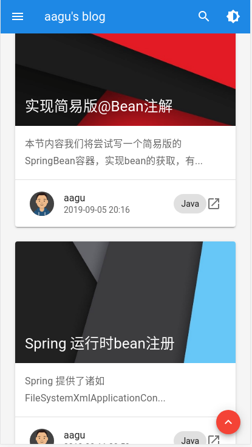
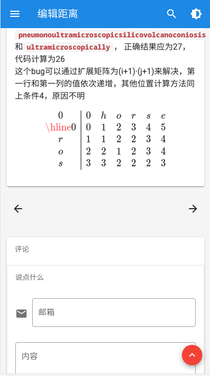
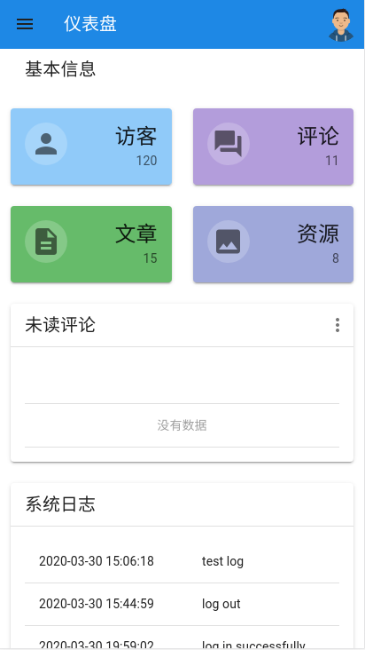

# material-blog

使用Vuetify.js搭建的博客主题，响应式布局，提供美观的桌面以及移动端体验

## Demo

[aagu的博客](http://aagu.ltd)

## Screenshot

### markdown渲染，latex支持，写作好方便

### 暗色模式，夜间不伤眼

### 自带后台控制

### 移动端一样完美显示

### 如果你喜欢，欢迎star